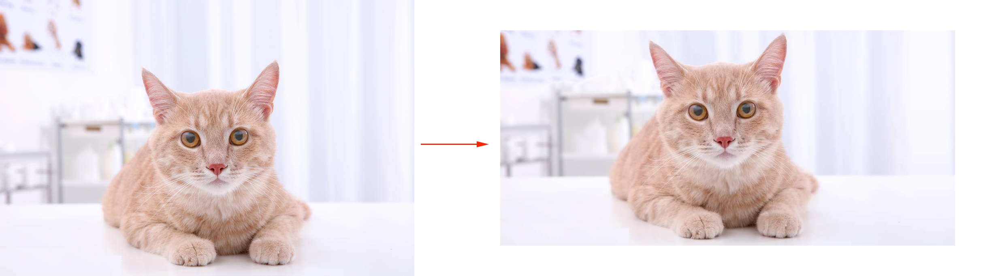

Seam Carving Crop

This is a implementation of Seam Carving Crop ,Support image scaling.
Avidan and Shamir, “Seam Carving for Content-aware Image Resizing”


# Requirements
Opencv 2.5+
# Using

```
  $ g++ -fopenmp -m64 -Wno-sign-compare seamcarv.cpp -std=c++11 -o SCC `pkg-config --cflags --libs opencv`
```
./SCC [inputpath] [w1] [h1] [h2] [w2] [outputpath]

w1:How many pixels are compressed horizontally

h1:How many pixels are compressed longitudinally

w2:How many pixels are expaned horizontally

h2:How many pixels are expaned longitudinally
```
$ ./SCC ~/Downloads/cat.jpeg 0 150 100 0 ~/sem.jpg
```
#--


